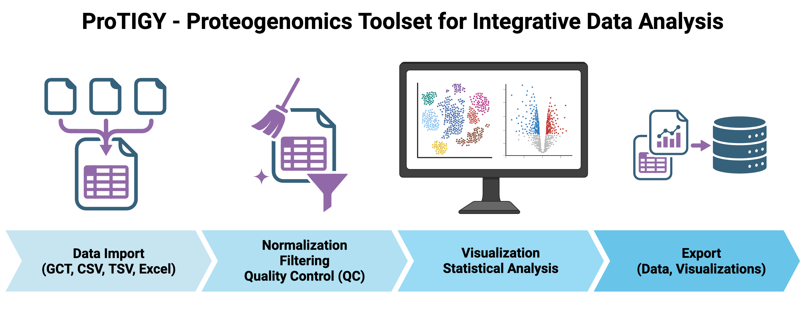

# ProTIGY - Proteogenomics Toolset for Integrative Data Analysis



ProTIGY is a Shiny application that supports datasets organized as a matrix with features (proteins, genes, transcripts) measured across samples (experimental conditions, replicates). ProTIGY can analyze various omics data types including proteomics, post-translational modifications (PTMs), RNA-seq, metabolomics, and other quantitative molecular datasets. ProTIGY allows you to upload and process multiple data types from the same experiment simultaneously (e.g., RNA-seq, proteome, and phosphoproteome data from the same samples), enabling integrated multi-omics analysis.

## Key Features

### 📊 **Data Analysis & Visualization**
- **Quality Control (QC)**: Boxplots, profile plots, correlation analysis, and PCA plots
- **Statistical Analysis**: Moderated t-tests, F-tests, and volcano plots
- **Interactive Plots**: Zoom, pan, and explore your data
- **Summary Statistics**: Data overview and sample information

### 🔧 **Data Processing**
- **Normalization**: Multiple methods including median, quantile, and VSN normalization
- **Filtering**: Remove missing data, low-variance features, and non-reproducible measurements
- **Transformation**: Log transformation and other data preprocessing options

### 📁 **Data Import & Export**
- **Multi-omics Support**: Upload and analyze multiple data types from the same experiment simultaneously
- **Supported Formats**: GCT v1.3, CSV, TSV, and Excel files
- **Export Options**: High-quality figures (PDF), GCT files for data, and CSV files for statistics

## UI Navigation

### Sidebar Controls
- Use the **Sidebar** to upload your dataset(s) and configure analysis settings
- Click the **arrow icon** (← Collapse / → Expand) next to the sidebar to close/open the sidebar
- You may change the default dataset anytime using the sidebar

### Multiple Dataset Tabs
If multiple datasets are uploaded, there will be multiple tabs on each page allowing you to view the plots for each dataset separately. You can change the default dataset using the sidebar.

### Plot Customization
Many plots have a **double cogwheel** icon in the top right corner. Clicking this icon provides customization options for the plots. Your customization options will be saved and used for exports.

### Changing Settings
If you need to change settings such as normalization/filtering or the default annotation, use the "Back to Setup" button in the sidebar to modify these options.

## Installation

```bash
# Clone the repository
git clone https://github.com/broadinstitute/protigy-v2.git
cd protigy-v2

# Install the package
R -e "devtools::install('.')"
```

## Quick Start

### 1. **Upload Your Data**
- Upload one or more files from the same experiment (e.g., different omes such as RNA-seq, prot, phos)
- Files should have overlapping samples but not all samples need to be in all files

**Supported Formats:**
- **GCT**: Gene Cluster Text format (`.gct`) - v1.3 format
- **CSV**: Comma-separated values (`.csv`)
- **TSV**: Tab-separated values (`.tsv`) 
- **Excel**: Microsoft Excel files (`.xlsx`, `.xls`)

**File Requirements:**
- **GCT files**: Must follow GCT v1.3 format specification
- **CSV/TSV/Excel files**: First row must contain column headers
- Data should have features as rows, samples as columns
- Missing values should be empty cells or `NA`
- All files must be the same type

**Test Data Available:**
- Sample datasets are included in `inst/extdata/` for testing and learning
- Includes GCT files: `brca_retrospective_v5.0_*_gct.rda` (proteome, phosphoproteome, RNA-seq)
- Also includes CSV, TSV, and Excel versions of sample data for testing different file formats
- Use these files to explore ProTIGY's features before uploading your own data

### 2. **Assign Labels**
Assign meaningful labels to each of your uploaded files. These labels will be used throughout the analysis to identify your datasets.

**Examples of good labels:**
- "prot" (for proteome)
- "phos" (for phosphoproteome) 
- "acetyl" (for acetylome)
- "RNA-seq"

**Requirements:**
- Each label must be unique
- Labels cannot be empty
- Keep labels concise (e.g., "prot" instead of "proteome")

### 3. **Additional Setup for CSV/TSV/Excel Files**
For CSV/TSV/Excel files, you'll also need to:
- Select identifier columns (choose which column contains unique feature identifiers)
- Upload experimental design metadata (sample information and experimental conditions)

### 4. **Explore Your Data**
- Use the **QC** tabs to examine data quality:
  - **Boxplots**: Check data distribution across samples
  - **Profile Plots**: Visualize individual feature profiles
  - **Correlation**: Assess sample relationships
  - **PCA**: Identify patterns and outliers

### 5. **Run Statistical Analysis** (Optional)
- Statistical analysis is optional - you can use ProTIGY just for QC and data export
- Navigate to **Statistics** → **Setup** to configure your analysis
- Select statistical tests based on your experimental design
- View results across multiple Statistics subtabs

### 6. **Export Results**
- Export high-quality figures (PDF), data files (GCT), and statistical results (CSV)
- Select which datasets and which modules to export using the dropdown menus

## Technical Requirements

- **R Version**: 4.0.0 or higher
- **Memory**: Minimum 8GB RAM recommended; 16GB+ for large datasets (>10,000 features and >50 samples)

## Recommended Software

- **RStudio**: [Download RStudio](https://www.rstudio.com/products/rstudio/download/) (recommended for running ProTIGY)

## Getting Help

- **General Help**: The application includes comprehensive help documentation accessible through the Help tab
- **Analysis Help**: Detailed guidance on analysis parameters and options is available within the application
- **Technical Support**: For technical support or feature requests, please submit via [GitHub Issues](https://github.com/broadinstitute/protigy-v2/issues)

## Development

This is a revamp of the original [Protigy app](https://github.com/broadinstitute/protigy) with enhanced multi-omics capabilities and improved user interface.

---

*ProTIGY is developed and maintained by the Broad Proteomics Platform. For technical support or feature requests, please submit via [GitHub](https://github.com/broadinstitute/protigy-v2).*
